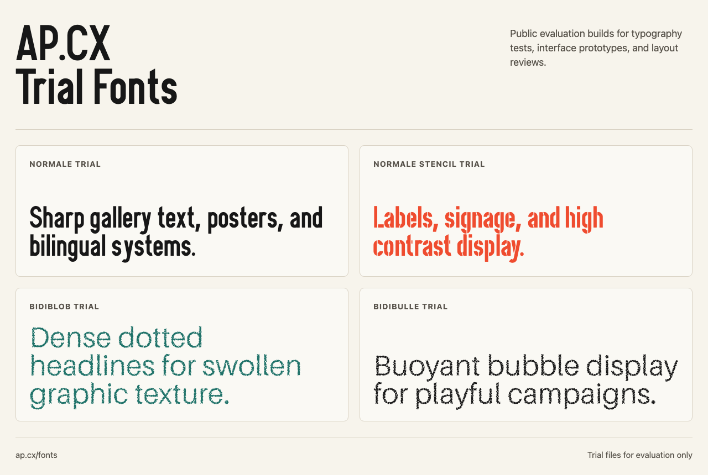

# AP.CX Fonts



Public trial font packages from [AP.CX](https://ap.cx), the type foundry of Another Planet Creative Experience.

This repository exists to make AP.CX trial fonts easy to inspect, install, and test in design or development workflows. The files here are intended for evaluation, layout testing, previews, and integration checks before choosing the right AP.CX font for production work.

## Fonts Included

| Family | Folder | Package |
| --- | --- | --- |
| Normale Trial | `fonts/normale/` | `packages/normale/normale-1.000-trial.zip` |
| Normale Stencil Trial | `fonts/normale-stencil/` | `packages/normale-stencil/normale-stencil-1.000-trial.zip` |
| Bidiblob Trial | `fonts/bidiblob/` | `packages/bidiblob/bidiblob-1.000-trial.zip` |
| Bidibulle Trial | `fonts/bidibulle/` | `packages/bidibulle/bidibulle-1.000-trial.zip` |

SquareBot Sans is a separate free/open-source font. Its intended future source repository is [thierryc/squarebot-sans](https://github.com/thierryc/squarebot-sans). That repository is not created as part of this package.

## Repository Layout

```text
fonts/
  <font-slug>/
    *.otf
    *.ttf
    *.woff2
packages/
  <font-slug>/
    *-trial.zip
preview/
  index.html
  preview.png
```

Use `fonts/<font-slug>/` when you want individual files. Use `packages/<font-slug>/` when you want the same portable trial ZIP exposed on the AP.CX website.

## Desktop Use

Install the `.otf` or `.ttf` files from a family folder:

1. Download or clone this repository.
2. Open the font folder you want, for example `fonts/normale/`.
3. Install the `.otf` or `.ttf` files through your operating system's font manager.
4. Restart design apps if they do not pick up newly installed fonts immediately.

Variable `.ttf` files are included for families that have a trial variable build. Static `.otf` files are included where the family is distributed as separate trial styles.

## Web Use

Use `.woff2` files for local web prototypes:

```css
@font-face {
  font-family: "Normale Trial";
  src: url("./fonts/normale/NormaleTrial-fvVF.woff2") format("woff2");
  font-weight: 100 900;
  font-style: normal;
  font-display: swap;
}

.headline {
  font-family: "Normale Trial", system-ui, sans-serif;
}
```

The preview page at [`preview/index.html`](preview/index.html) shows a minimal local `@font-face` setup for all included trial families.

## Why This Exists

AP.CX font pages are designed for rich specimens and buying context. This repository is designed for file access:

- quick downloads for public trial builds;
- easier testing in design tools, prototypes, and browser projects;
- stable GitHub links for teams that prefer to review assets in source control;
- a clear separation between public trial files and full commercial packages.

For production, commercial, client, embedded, or redistributed use, follow the terms on [AP.CX](https://ap.cx) and the [AP.CX font license](https://ap.cx/font-license). Full paid commercial packages are not included in this repository.

## Links

- Website: [ap.cx](https://ap.cx)
- Font license: [ap.cx/font-license](https://ap.cx/font-license)
- Intended SquareBot Sans source repository: [github.com/thierryc/squarebot-sans](https://github.com/thierryc/squarebot-sans)
